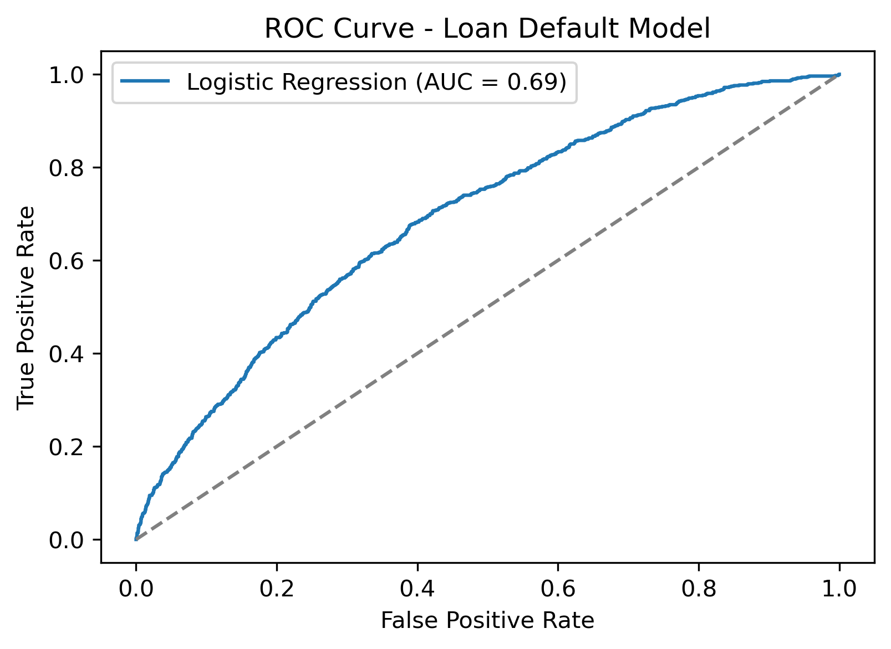
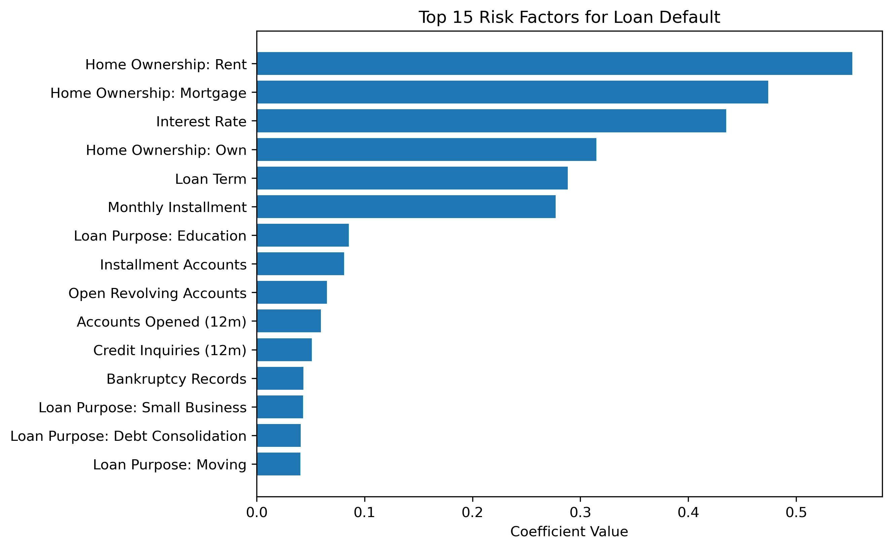

# Lloyds Banking Group - Loan Default Risk Analysis

## Project Overview

This project analyses historical loan data from Lloyds Banking Group to understand the characteristics and financial behaviour of borrowers who default on their loans, and to estimate the probability of default (PD) for future lending decisions.

A logistic regression model is developed using borrower financial information, loan attributes and credit behaviour indicators to estimate default risk and identify the key drivers of loan default.

---

## Key Results

### Model Performance

ROC curve of the logistic regression model.



Model performance:

- ROC-AUC: ~0.69
- Recall (default class): ~62%

---

### Key Risk Drivers

Top features associated with higher loan default risk.



The model suggests that higher **interest rates**, longer **loan terms**, larger **monthly installments**, and more frequent **credit inquiries** are associated with increased default risk.

---

## Dataset

The dataset contains **18,324 historical loan records** with **31 variables**, including borrower profile, loan characteristics and credit behaviour indicators.

Target variable:

loan_status (Fully Paid vs Charged Off)

---

## Methodology

The analysis followed a standard credit risk modelling workflow:

1. Data cleaning and preprocessing  
2. Feature engineering and one-hot encoding  
3. Exploratory analysis  
4. Logistic regression baseline model  
5. Model evaluation using ROC-AUC and classification metrics  
6. Identification of key risk drivers  

---

## Repository Structure

```
Lloyds_Loan_Default_Project
│
├── data
│   └── loans_dataset.xlsx
│
├── notebooks
│   └── Lloyds_Loan_Default_Project.ipynb
│
├── src
│   └── Lloyds_Loan_Default_Project.py
│
├── outputs
│   ├── annual_income_distribution.png
│   ├── Interest_Rate_distribution.png
│   ├── Loan_Amount_distribution.png
│   ├── Average_Current_Balance_distribution.png
│   ├── Total_Balance_Excluding_Mortgage_distribution.png
│   ├── Key_Risk_Factors_of_Loan_Default.png
│   ├── TOP15_Risk_Factors.png
│   └── ROC_Curve.png
│
├── presentation
│   ├── Bruce_Chengdou_Lloyds_Project.pdf
│   └── Bruce_Chengdou_Lloyds_Project.pptx
│
└── README.md
```

---

## Tools
Python
- Pandas
- NumPy
- Scikit-Learn
- Matplotlib

